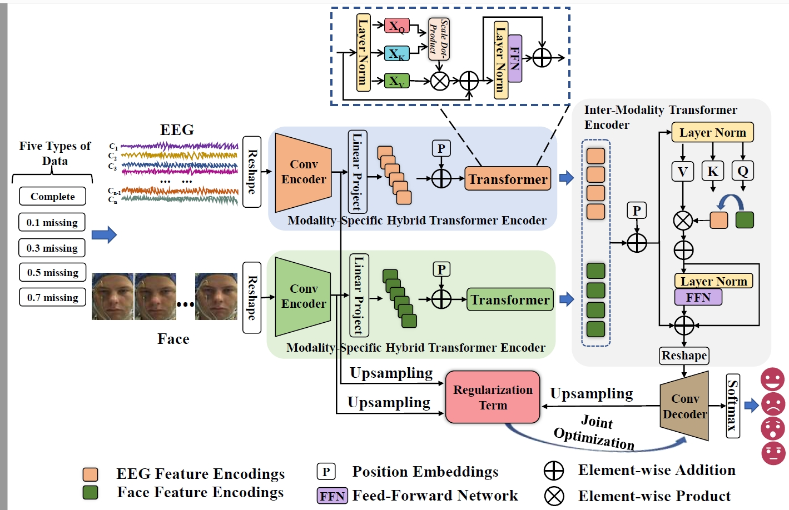

# A Novel Transformer Autoencoder for Multi-modal Emotion Recognition With Incomplete Data

## introduction

The TAE model includes a modality-specific hybrid transformer encoder to extract the local and global features with each particular modality, an inter-modality transformer encoder to extract the long-range contextual information with multi-modal features, a decoder to optimize the features, and a regularization term connects the convolutional encoder and the convolutional decoder to improve the representation of incomplete data and to achieve joint optimization of the model.

## Dataset
We evaluate our model on DEAP and SEED-IV datasets, and the extracted differential entropy (DE) features of the EEG signals in these datasets are used.

## Usage
Training model:
Cross_DEAP_II.py
